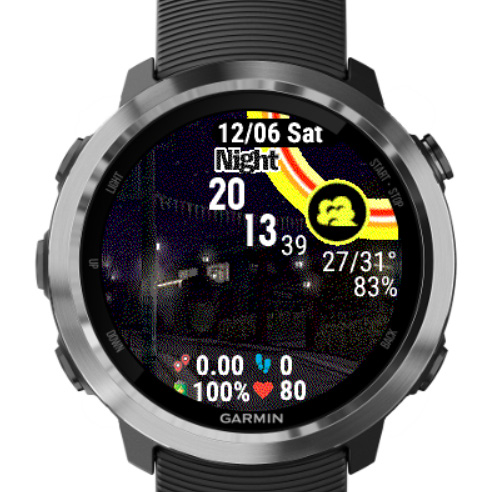

# Persona 4 Watchface

  
  

This is a watchface for the Garmin Forerunner 645. It will work on the 245, 735, 745, and 945s, though small tweaks may be required to correctly position the time widget on those devices. The app features heart rate, steps, distance, battery, temperature (feels like and actual), humidity, a Persona 4 HUD, as well as a background that changes depending on the time of day or weather. Also has a special Dark Hour effect from Persona 3 if you look at the watch a few seconds before midnight strikes:

  

To display weather information, you will have to [obtain a OpenWeatherMap API key](https://openweathermap.org/appid "obtain a OpenWeatherMap API key") and include it on line 12 of the `/source/Background.mc` file. Specify the latitude and longtitude of your location in the app settings through the Connect IQ app on your synched phone.
